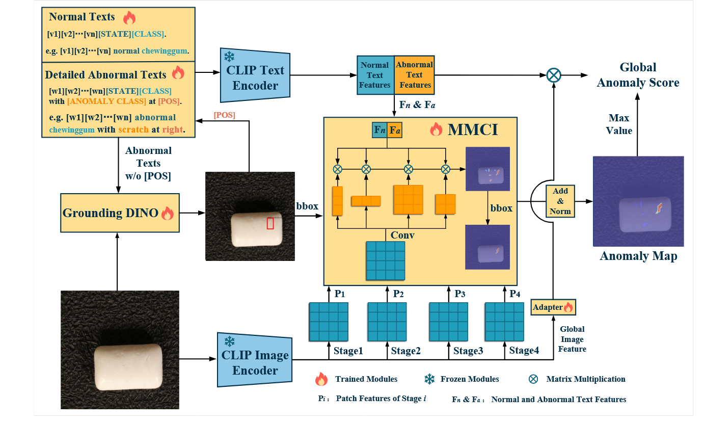

# FiLo 模型框架说明



## 1. 执行流概览

1. **数据载入**：`datasets/mvtec_supervised.py:9` 与 `datasets/visa_supervised.py:9` 负责将 `meta.json` 中的样本路径、mask、类别与缺陷标签打包成字典，并应用图像/掩码的双重变换（`train.py:97-129`、`test.py:692-717`）。
2. **视觉特征抽取**：`FiLo` 在初始化阶段创建定制版 OpenCLIP（`models/FiLo.py:533-551`），调用 `models/vv_open_clip/model.py:212` 的 `encode_image(image, out_layers)` 输出 `[B, L, 1024]` 的 patch tokens 及 `[B, 1, 1024]` 的 CLS token。
3. **语言分支（FG-Des）**：`PromptLearner_normal` 与 `PromptLearner_abnormal`（`models/FiLo.py:156`、`260`）根据类别和可学习上下文生成一组正常/异常 prompt tokens；异常 prompt 额外拼接 3×3 位置短语以适配 HQ-Loc。
4. **文本编码**：`TextEncoder`（`models/FiLo.py:389`）复用 OpenCLIP transformer，将 prompt tokens 映射到 L2 归一化的文本特征；异常特征按位置或整体平均。
5. **适配层 & MMCI**：
   - `Adapter`（`models/FiLo.py:437`）在需微调时对 CLS 特征做残差调节。
   - `LinearLayer` + `CovLayer`（`models/FiLo.py:424`、`452`）将多尺度 patch tokens 投影到 768 维并通过 1/3/5/7/1×5/5×1 等卷积核实现多形状交互（MMCI）。
6. **相似度与热力图**：`FiLo.forward`（`models/FiLo.py:557-707`）计算图像特征与 `[normal, abnormal]` 文本特征的余弦得分，输出图像级 logits `text_probs` 及逐尺度像素概率图 `anomaly_maps`。
7. **HQ-Loc 推理**：`test.py:413-610` 利用 Grounding DINO 先获得候选框（`load_model`、`get_grounding_output`），筛选文本短语后将位置传回 `FiLo.forward(..., positions=…)`，并对热力图进行框内强化 / 框外抑制。
8. **度量与可视化**：`test.py:612-741` 聚合 `anomaly_maps` 得到指标（AUROC/F1/AUPRO），同时将热力图、候选框、Top-K prompt 导出到 `viz_dir`。
9. **训练闭环**：`train.py:187-260` 采用两阶段流程——先冻结 Adapter、优化解码器+Prompt，再只训练 Adapter；损失由 `utils/loss.py` 的 `FocalLoss` 与 `BinaryDiceLoss` 组成。

下文按组件拆解模块、关键接口与数据流，帮助在不同阶段进行调试或二次封装。

## 2. 组件拆解

### 2.1 数据与预处理
- **Dataset**：
  - `MVTecDataset`/`VisaDataset`（`datasets/mvtec_supervised.py:9`、`datasets/visa_supervised.py:9`）返回字典：`{'img', 'img_mask', 'cls_name', 'anomaly', 'anomaly_class', ...}`。MVTec 训练模式支持 `combine_img` 增强。
  - `DataLoaderX`（`train.py:16`、`test.py:40`）继承 `torch.utils.data.DataLoader` 并引入 `prefetch_generator`，与标准 PyTorch 接口一致。
- **Transforms**：
  - 训练：`train.py:131-143` 使用 `Resize -> CenterCrop -> ToTensor -> Normalize` 组合。
  - 推理：`test.py:692-714` 重用 `open_clip.create_model_and_transforms` 输出的 `preprocess` 以及单独的可视化尺度 transform。

### 2.2 视觉主干与特征接口
- **OpenCLIP 包装**：`FiLo.__init__`（`models/FiLo.py:533-551`）通过 `open_clip.create_model_and_transforms` 创建 `self.clip_model`，其 `encode_image` 在 `models/vv_open_clip/model.py:212` 被扩展，支持传入 `out_layers=[6,12,18,24]` 等索引以返回多层 patch tokens。
- **接口**：
  ```python
  image_features, patch_tokens = self.clip_model.encode_image(image, self.args.features_list)
  ```
  - `image_features`: `[B, L_img, 1024]`（默认第一维为 CLS）。
  - `patch_tokens`: list，偶数索引喂入 `LinearLayer`，奇数索引喂入 `CovLayer` 用于 MMCI。

### 2.3 Prompt 学习（FG-Des）
- **词表生成**：在 `models/FiLo.py:23-150` 内，将论文中 LLM 产出的缺陷短语映射到 `status_abnormal` 字典，不同类别共享或合并标签（如 pcb/macaroni 重映射）。
- **PromptLearner_normal**（`models/FiLo.py:156-247`）：
  - 输入：`classnames`, `status_normal`, `clip_model`, `tokenizer`, `dim`, `n_ctx`, `device`。
  - 机制：使用 `nn.Parameter ctx` 作为可学习上下文，并通过 `meta_net`（线性+ReLU+线性）根据图像特征产生偏移，再与 prefix/suffix (由 tokenizer embedding 固定) 拼接。
- **PromptLearner_abnormal**（`models/FiLo.py:260-373`）：
  - 除了类别描述，还遍历 `self.positions`（默认九宫格）生成 “abnormal {cls} with {detail} at {pos}.” 逐位置 prompt，便于 HQ-Loc。
  - 其 `forward` 接口与正常 prompt 相同，但返回的 prompt 数量 = `len(status[cls])*len(positions)`，后续可按位置子集筛选。

### 2.4 文本编码与归一化
- **TextEncoder**（`models/FiLo.py:389-418`）：直接引用 OpenCLIP 的 transformer、LN 以及投影矩阵，并在 `forward` 中查找 `[EOT]` 所在向量。
- **Normalize**（`models/FiLo.py:415`）与手动 `/ feat.norm` 共同确保文本与视觉特征处于单位球面，便于用矩阵乘法表示余弦相似度。

### 2.5 Adapter 与解码头（MMCI）
- **LinearLayer**（`models/FiLo.py:424-436`）：对 transformer token（去掉 CLS）使用独立的线性层，得到 `[B, H×W, 768]` 的 query/key。
- **CovLayer**（`models/FiLo.py:452-520`）：对 patch token reshape 后并行施加 1×1/3×3/5×5/7×7/1×5/5×1 卷积，再展平成 `[B, H×W, 768]` 作为 value，模拟论文的 Multi-scale Multi-shape Cross-modal Interaction。
- **Adapter**（`models/FiLo.py:437-450`）：两层 linear + ReLU + SiLU 的残差块，仅在 `with_adapter=True` 时启用；训练阶段拆分为“主干 (decoder+prompt)”与“adapter”两个优化器（`train.py:187-260`）。

### 2.6 相似度计算与热力图
- **文本特征聚合**：
  - 正常文本：对同类 prompt 求均值并归一化（`models/FiLo.py:610-629`）。
  - 异常文本：若 `positions` 参数存在则先切片对应位置，再均值归一化（`models/FiLo.py:631-650`）。
  - 拼接后形成 `text_features` `[B, 2, 768]`（normal vs abnormal）。
- **图像级得分**：`text_probs = image_features[:,0,:] @ text_features.transpose(-2, -1)`（`models/FiLo.py:651-657`），输出 `[B, 2]` logits。
- **像素级得分**：
  - 对 `decoder_linear`/`decoder_cov` 的输出分别与 `text_features` 做矩阵乘，重排成 `[B, 2, H, H]`，经 `F.interpolate(..., size=image_size)` 还原到输入分辨率。
  - `torch.softmax` 得到 `anomaly_maps` 列表（`models/FiLo.py:662-701`），推理时会被平均并高斯平滑（`test.py:907-915`）。

### 2.7 HQ-Loc 推理管线
- **Grounding DINO**：
  - `load_model`（`test.py:401`）加载配置与 checkpoint；
  - `get_grounding_output`（`test.py:413-458`）根据异常描述生成候选框与短语。
- **框筛选与位置增强**：`test.py:764-836` 过滤非缺陷短语、转换坐标并根据分数挑选顶级框，然后映射到九宫格位置传入 `FiLo.forward(with_adapter=True, positions=position)`。
- **框引导热力图**：`test.py:915-938` 将框区域掩码设为 1，其它区域按 `DOWNWEIGHT_OUTSIDE_BOX` 衰减，重现论文 HQ-Loc 中“背景抑制”策略。
- **可视化/日志接口**：`_save_viz_and_logs`（`test.py:54-154`）会导出灰度 mask、overlay、json/csv，方便排查每一步的候选框与 prompt。

### 2.8 训练与损失
- **阶段一**：`train.py:187-217` 使用 `FocalLoss + BinaryDiceLoss`（`utils/loss.py:5-72`、`utils/loss.py:75-111`）监督 `anomaly_maps`，优化解码器与 PromptLearner。
- **阶段二**：`train.py:221-260` 仅训练 Adapter，并用 `F.cross_entropy` 对图像级 `text_probs` 进行正负分类。
- **优化器**：`AdamW`，主干/decoder/adapter 拥有不同学习率，可在 `train.py` 参数中调整。

## 3. 接口速查表

| 阶段 | 模块/接口 | 主要输入 | 主要输出 | 位置 |
| --- | --- | --- | --- | --- |
| 数据 | `MVTecDataset.__getitem__` / `VisaDataset.__getitem__` | `index` | `dict(img, img_mask, cls_name, anomaly, ...)` | `datasets/mvtec_supervised.py:45` / `datasets/visa_supervised.py:39` |
| 视觉主干 | `clip_model.encode_image(image, out_layers)` | `image`, `[6,12,18,24]` | `(image_features, patch_tokens)` | `models/vv_open_clip/model.py:212` |
| Prompt | `PromptLearner_* .forward(im_features, class_name)` | `[B, 1024]`, `str` | `[B, n_prompt, n_tokens, 768]` | `models/FiLo.py:210` / `models/FiLo.py:315` |
| 文本编码 | `TextEncoder.forward(prompts, tokenized_prompts)` | prompt tensor, token ids | `[n_prompt, 768]` | `models/FiLo.py:392-408` |
| Adapter | `Adapter.forward(x)` | `[B, 1024]` | `[B, 1024]` | `models/FiLo.py:437-450` |
| MMCI | `decoder_linear` / `decoder_cov` | patch tokens | `[B, HW, 768]` | `models/FiLo.py:424-520` |
| 相似度 | `FiLo.forward(items, with_adapter, positions)` | dataloader batch, flags | `(text_probs, anomaly_maps)` | `models/FiLo.py:557-707` |
| HQ-Loc | `get_grounding_output(...)` | DINO 模型、caption、阈值 | `boxes_filt, pred_phrases` | `test.py:413-458` |
| 指标 | `cal_score(obj)` | `results dict` | 多种 AUROC/AP/F1/AUPRO | `test.py:330-386` |

## 4. 使用建议

- 若需改动提示词或位置策略，可直接修改 `status_normal/status_abnormal` 以及 `PromptLearner_abnormal.positions`，并在测试阶段通过 `position` 参数传入自定义子集。
- 想替换视觉 backbone，可在 `FiLo.__init__` 中更换 `clip_model` 并确保 `decoder_*` 的输入维度与输出维度匹配。
- 二次封装时，可以本文件的接口速查表为“模块化 API”，例如：
  1. 自定义推理：复用 `clip_model.encode_image` 与 `PromptLearner` 输出，随后自行实现相似度或注意力分支；
  2. 自定义定位：沿用 `test.py` 中 `get_grounding_output` 的封装，将其它检测器输出的框/短语映射回 FiLo 的 `positions` 机制即可。

通过以上拆解即可对照源码快速定位“每一步/每一层”的职责与接口，便于在 FiLo 框架上进行调试、裁剪或扩展。若需要更细的参数含义，可结合 `ModelDetail.md` 与论文 PDF（第 3 节 FG-Des / HQ-Loc）阅读。 
